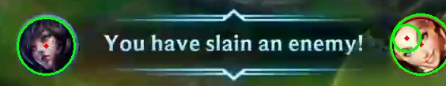
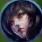
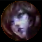

# Wild Drift Champions Detection

Preprocessing steps:

* Dectect circles in test images. A circle can be described using three parameters - row index, column index, and radius. The row and column indices represent the location of the circle's center.

  
* Select the left most circle in the detected list (the circle that has the smallest column index).
* Crop the image precisely to the diameter of the selected circle's edge.
* Resize the cropped images to `42 x 42` pixels to match the ground truth's size.

  `Cropped test image:` 			`Ground truth:` 		

- Mask the pixels in the ground truth and test image that lie beyond the boundary of the detected circle.
- `Masked test image:` 			`Masked ground truth:` 
- Normalize the ground truth and test image (Min-Max Normalization).

Compare test images to groundtruths:

* Distances for comparing two images: `Structural Similarity Index Measure` (SSIM), `Peak Signal-to-Noise Ratio` (PSNR).
* For each test image, iterate through the ground truth set and calculate SSIM and PSNR.
* The ouput of a test image is the label of the reference image that has the highest score (SSIM/PSNR) when compared to the test image.

Accuracy:

* Without masking, without normalization:
  * SSIM: 52.041%
  * PSNR: 40.816%
* With masking, without normalization:
  * SSIM: 59.184%
  * PSNR: 53.061%
* Without masking, with normalization:
  * SSIM: 58.163%
  * PSNR: 61.224%

Usage:

```
py main.py mode refpath testpath [--distance]

positional arguments:
mode: 	accept one of the "test" or "predict" values; 
	"test" mode calculates the accuracy of the classifier;
	"predict" mode outputs the name of the specified champion.
refpath: path to ground truths (contain folder "image" and file metadata.txt).
testpath: path to folder "test_data" if mode is "test", otherwise path to a specific image.

optional arguments:
--distance: 	distance for comparing two images, 
		accept one of the "ssim" or "psnr" values used for "predict" mode, default "ssim".

```
